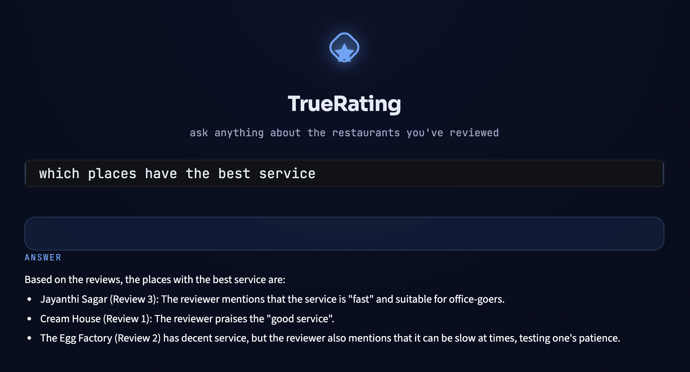

# TrueRating (Beta)

TrueRating is a generalized, dataset-agnostic pipeline that computes **credibility-weighted restaurant ratings** from raw review text, then serves them through a RAG (Retrieval-Augmented Generation) assistant with a Streamlit UI.

Instead of trusting a platform's raw average star rating (which is vulnerable to spam, fake reviews, and generic low-effort text carrying the same weight as a detailed, informative one), TrueRating re-derives an overall rating from the review text itself — extracting per-aspect sentiment, discounting spam/near-duplicate reviews, weighting reviews by how informative and substantial they are, and aggregating that into a `true_overall_rating` per restaurant.

> **Status: Beta.** The pipeline, architecture, and UI are complete and working end-to-end. Accuracy against real-world ratings is currently limited by review-extraction coverage rather than by the underlying method — see [Tradeoffs & Current Limitations](#tradeoffs--current-limitations) below for the honest numbers.

**Live demo (Zomato Bangalore dataset):** `https://truerating-tqq4ibcqtjugfgqxychqyx.streamlit.app`

---


## Table of Contents

- [The Problem](#the-problem)
- [Features](#features)
- [Architecture](#architecture)
- [Project Structure](#project-structure)
- [Quickstart: Running an Existing Dataset](#quickstart-running-an-existing-dataset)
- [Running TrueRating on a New Dataset](#running-truerating-on-a-new-dataset)
- [The Pipeline, Stage by Stage](#the-pipeline-stage-by-stage)
- [Evaluation Metrics](#evaluation-metrics)
- [Current Beta Results (Zomato, 3,000 Reviews)](#current-beta-results-zomato-3000-reviews)
- [Tradeoffs & Current Limitations](#tradeoffs--current-limitations)
- [Deployment](#deployment)
- [Screenshots](#screenshots)
- [Roadmap](#roadmap)

---
## The Problem

Platforms like Zomato, Yelp, and TripAdvisor surface a single average star rating per restaurant — but that number treats every review as equally trustworthy. In practice, it isn't:

- **Spam and near-duplicate reviews** (copy-pasted, lightly reworded, or incentivized) count exactly as much as a genuine one.
- **A two-word review** ("good food", "would recommend") carries the same weight as a detailed, specific one that actually describes the food, service, or hygiene.
- **The rating is a single number**, collapsing taste, hygiene, service, value, and delivery into one score — so a restaurant with amazing food but terrible delivery looks identical to one that's mediocre at everything.
- **There's no way to ask a question.** A user who wants "a place with fast delivery and good hygiene" has to read through dozens of reviews manually; the platform can't answer that directly.

For a company like Zomato, this matters commercially, not just academically: rating integrity is core to user trust, spam/fake reviews are an active adversarial problem, and aspect-level detail (not just an overall score) is what users actually want when deciding where to eat. TrueRating is a proof-of-concept for solving this: re-deriving a rating directly and transparently from review text, discounting low-trust content instead of averaging it in blindly, preserving aspect-level detail instead of collapsing it, and exposing all of it through a natural-language interface instead of a static number.

---

## Features

**Dataset-agnostic ingestion.** A pluggable adapter system (`adapters/`) means any restaurant review dataset can be onboarded by writing one small adapter file — no changes to the rest of the pipeline. Ships with adapters for the Yelp Open Dataset and the Kaggle Zomato Bangalore Restaurants dataset.

**Aspect-based sentiment extraction.** Every review is broken down into five aspects — taste, hygiene, service, value, delivery — each scored -1.0 to 1.0, via an LLM (Groq/Llama), rather than collapsing a review into a single number. Aspects genuinely not mentioned in a review are left `null`, not defaulted to neutral, so the aggregation never pretends a review said something it didn't.

**Credibility weighting, not just averaging.** Every review gets a 0.1-1.0 credibility weight from review length, how many aspects it actually covers, and whether it's flagged as "informative" — so a two-word "good food" review counts for far less than a detailed, specific one.

**Spam / near-duplicate detection.** Review text is embedded (`sentence-transformers/all-MiniLM-L6-v2`) and any pair within the same restaurant with cosine similarity > 0.90 has its newer copy flagged as spam and excluded entirely.

**Grounded RAG assistant.** A command-palette style Streamlit UI lets you ask natural-language questions ("best budget spot for a family dinner") and get answers grounded only in high-credibility, non-spam reviews retrieved from a ChromaDB vector store — with an explicit "I don't know" fallback if nothing credible is retrieved, rather than hallucinating.

**Live data-visualization dashboard.** Every query renders per-restaurant aspect line charts, an overall-rating bar chart, and a credibility-mix donut chart alongside the answer.

**Built-in A/B testing.** Compare a broad-recall retrieval strategy (credibility weight > 0.5) against a high-credibility-only strategy (> 0.8) on the same query, with an independent LLM "referee" scoring both responses on relevance, evidence use, and conciseness, and declaring a winner.

**A real evaluation harness.** `evaluate.py` computes authenticity, accuracy, and performance metrics at every stage of the pipeline — including correlating TrueRating's computed score against a dataset's own independent crowd rating, when one exists (e.g. Zomato's `rate` column), which is the closest thing to genuine ground-truth validation this kind of system can have.

---

## Architecture

```
Raw dataset (CSV/JSON/...)
        |
        v
  adapters/<name>.py  --  parses the dataset into RestaurantRecord/ReviewRecord objects
        |
        v
     ingest.py         --  dataset-agnostic: schema, filtering, sampling, SQLite persistence
        |
        v
     extract.py         --  LLM aspect extraction -> aspect_scores table
        |
        v
     credibility.py      --  embeddings, spam detection, credibility weights -> review_weights + ChromaDB
        |
        v
      score.py           --  credibility-weighted aggregation -> restaurant_scores table
        |
        +----> rag.py        (terminal RAG assistant)
        +----> ab_test.py    (batch A/B testing engine)
        +----> evaluate.py   (metrics harness)
        +----> app.py        (Streamlit UI -- the actual product)
```

Every stage after `ingest.py` only ever reads the generic `restaurants` / `reviews` SQLite schema. None of them know or care which adapter produced the data — that's what makes the platform reusable across datasets.

---

## Project Structure

```
TrueRating/
├── adapters/
│   ├── __init__.py       # adapter registry
│   ├── base.py            # BaseDatasetAdapter interface + RestaurantRecord/ReviewRecord
│   ├── yelp.py             # Yelp Open Dataset adapter
│   └── zomato.py           # Zomato Bangalore Restaurants adapter
├── ingest.py               # unified ingestion CLI (dataset-agnostic)
├── extract.py              # Stage 1: aspect-based sentiment extraction (Groq/LangChain)
├── credibility.py          # Stage 2: spam detection + credibility weighting
├── score.py                # Stage 3: credibility-weighted restaurant scoring
├── rag.py                  # terminal RAG assistant
├── ab_test.py               # batch A/B testing engine with LLM referee
├── evaluate.py              # authenticity / accuracy / performance metrics harness
├── app.py                   # Streamlit UI (the deployed product)
├── requirements.txt
├── .env.example
└── .gitignore
```

---

## Quickstart: Running an Existing Dataset

```bash
git clone https://github.com/<your-username>/truerating.git
cd truerating
python3 -m venv venv
source venv/bin/activate        # Windows: venv\Scripts\activate
pip install -r requirements.txt
cp .env.example .env            # then edit .env and add your real GROQ_API_KEY
```

Get a free Groq API key at [console.groq.com/keys](https://console.groq.com/keys).

If you're starting from scratch (no database yet), run the full pipeline:

```bash
python3 ingest.py zomato --input zomato.csv --db truerating_zomato.db --sample-size 500 --min-reviews 10
python3 extract.py --db truerating_zomato.db
python3 credibility.py --db truerating_zomato.db --chroma-path ./chroma_db_zomato
python3 score.py --db truerating_zomato.db
```

Then launch the UI:

```bash
TRUERATING_DB=truerating_zomato.db TRUERATING_CHROMA_PATH=./chroma_db_zomato TRUERATING_COLLECTION=truerating_reviews streamlit run app.py
```

Open `http://localhost:8501` and start asking questions.

---

## Running TrueRating on a New Dataset

This is the core of what makes TrueRating a platform rather than a one-off script. Onboarding a brand-new dataset takes exactly one new file:

**1. Write an adapter.** Create `adapters/<yourname>.py` implementing `BaseDatasetAdapter` (see `adapters/base.py` for the interface):

```python
from adapters.base import BaseDatasetAdapter, RestaurantRecord, ReviewRecord

class YourDatasetAdapter(BaseDatasetAdapter):
    name = "yourname"
    description = "One-line description of the dataset"

    def add_cli_arguments(self, parser) -> None:
        # Whatever CLI flags your adapter needs, e.g.:
        parser.add_argument("--input", required=True, help="Path to your raw data file")

    def load(self, args) -> list[RestaurantRecord]:
        # Parse your raw file(s) and return a list of RestaurantRecord objects,
        # each with a list of ReviewRecord objects attached.
        # Do NOT filter or sample here -- that's ingest.py's job, kept identical
        # across every dataset so behavior stays consistent.
        ...
```

**2. Register it** in `adapters/__init__.py`:

```python
from adapters.yourname import YourDatasetAdapter

ADAPTERS = {
    "yelp": YelpAdapter(),
    "zomato": ZomatoAdapter(),
    "yourname": YourDatasetAdapter(),
}
```

**3. Run the exact same pipeline** — nothing else changes:

```bash
python3 ingest.py yourname --input your_raw_data.csv --db truerating_yourname.db
python3 extract.py --db truerating_yourname.db
python3 credibility.py --db truerating_yourname.db --chroma-path ./chroma_db_yourname
python3 score.py --db truerating_yourname.db
TRUERATING_DB=truerating_yourname.db TRUERATING_CHROMA_PATH=./chroma_db_yourname streamlit run app.py
```

**One caveat:** `evaluate.py`'s flagship accuracy check (correlating `true_overall_rating` against a real independent rating) only works if your dataset carries something like Zomato's `rate` column — an independent crowd rating separate from the individual reviews. If `RestaurantRecord.reference_rating` is left `None` (as it is for Yelp, which has no such field), extraction/credibility/scoring/RAG all still work correctly, you just won't have that particular ground-truth check available.

---

## The Pipeline, Stage by Stage

| Stage | Script | Input | Output | Needs API key? |
|---|---|---|---|---|
| Ingestion | `ingest.py` | Raw dataset file(s) | `restaurants`, `reviews` tables | No |
| Extraction | `extract.py` | `reviews` | `aspect_scores` table | Yes (Groq) |
| Credibility | `credibility.py` | `reviews` + `aspect_scores` | `review_weights` table + ChromaDB vectors | No |
| Scoring | `score.py` | `reviews` + `aspect_scores` + `review_weights` | `restaurant_scores` table | No |
| RAG | `rag.py` / `app.py` | ChromaDB + `restaurant_scores` | Grounded answers + dashboard | Yes (Groq) |
| A/B testing | `ab_test.py` | Same as RAG | `ab_test_results.jsonl` + verdicts | Yes (Groq) |
| Evaluation | `evaluate.py` | Any/all of the above tables | Printed metrics report | Only for `--stage rag` |

Every stage is **idempotent and resumable** — re-running `extract.py` or `credibility.py` never re-processes a review it's already scored, so it's safe to interrupt and continue later, or to top up coverage incrementally over multiple sessions.

---

## Evaluation Metrics

Run `python3 evaluate.py --db <your.db> --stage all` for the full report. It checks three things:

**Authenticity** — does the model's output actually reflect what reviewers said? The key check here correlates the LLM's extracted aspect sentiment against the reviewer's *own* star rating (real, independent ground truth they gave themselves) — Pearson and Spearman correlation.

**Accuracy** — are TrueRating's final numbers defensible? The flagship check correlates `true_overall_rating` against the dataset's own independent crowd rating (e.g. Zomato's `rate` column) via Pearson r, Spearman r, MAE, RMSE (rescaled to a comparable 0-5 range), and top-20 ranking overlap.

**Performance** — is retrieval fast and complete? Average embed/retrieve latency, average hits per query, and zero-result query rate for the RAG stage.

---

## Current Beta Results (Zomato, 3,000 Reviews)

Full `evaluate.py --stage all` output on the Zomato Bangalore dataset (500 restaurants, 17,771 total reviews, 3,000 extracted — 16.9% coverage, ~6 reviews/restaurant on average):

**Data layer** — 500 restaurants, 17,771 reviews, 10-523 reviews/restaurant (mean 35.5, median 22), 99.6% reference-rating coverage, 2.58% duplicate review text (pre-deduplicated at ingestion), 0% empty reviews.

**Aspect extraction** — 3,000/17,771 reviews scored (16.9% coverage).

| Metric | Value |
|---|---|
| Sentiment vs. reviewer's own star rating (Pearson r) | **0.8313** |
| Sentiment vs. reviewer's own star rating (Spearman r) | **0.7878** |
| Comparable reviews (n) | 2,525 |
| Informative rate | 68.1% |
| Taste mentioned rate | 69.3% |
| Service mentioned rate | 31.4% |
| Value mentioned rate | 24.4% |
| Hygiene mentioned rate | 8.5% |
| Delivery mentioned rate | 7.9% |

**Credibility & spam detection**

| Metric | Value |
|---|---|
| Reviews weighted | 3,000 |
| Spam rate | 0.03% (1 review) |
| Weight mean / std | 0.685 / 0.240 |
| Weight vs. review length correlation | 0.577 |

**Scoring accuracy vs. Zomato's real ratings** — the flagship authenticity check, correlating `true_overall_rating` against Zomato's independent `rate` column:

| Metric | Value |
|---|---|
| Comparable restaurants | 498 / 500 |
| Pearson r | **0.4259** |
| Spearman r | **0.3744** |
| MAE (rescaled to 0-5) | 1.1413 |
| RMSE (rescaled to 0-5) | 1.43 |
| Top-20 ranking overlap | 2/20 (10%) |

**RAG retrieval & performance**

| Metric | Value |
|---|---|
| ChromaDB vector count | 3,000 |
| Avg. embed time | 37.8ms |
| Avg. retrieve time | 15.8ms |
| Avg. hits per query | 5.0 / 5 |
| Zero-result query rate | 0% |

**Reading these numbers honestly:** extraction quality is strong and stable (0.83 correlation with reviewers' own ratings, holding steady as coverage grew from 1,150 to 3,000 reviews). Credibility/spam mechanics are behaving exactly as designed. Retrieval is fast and complete. The one number still maturing is scoring accuracy against Zomato's real ratings (0.43 Pearson r) — moderate rather than strong, and directly attributable to coverage depth (~6 reviews/restaurant) rather than a flaw in the weighting method itself; re-running this same evaluation at increasing coverage (1,150 → 3,000 reviews) showed Pearson r, MAE, and RMSE all improving in the expected direction. See [Tradeoffs & Current Limitations](#tradeoffs--current-limitations) for why, and what it would take to close the gap.

---

## Tradeoffs & Current Limitations

Being upfront about these rather than hiding them is the point of calling this a beta.

**Extraction coverage vs. accuracy.** This is the single biggest lever on TrueRating's accuracy right now. On the Zomato dataset (500 restaurants, 17,771 total reviews), extraction was run on the first ~3,000 reviews (~6 reviews/restaurant on average). At that coverage, correlation against Zomato's real `rate` is moderate (Pearson r ≈ 0.43, MAE ≈ 1.14 on a 0-5 scale) rather than strong. The mechanism is understood: with only a handful of reviews per restaurant, a lucky run of a few positive reviews can push a restaurant's average all the way to a perfect ceiling score, and top-K ranking overlap is especially sensitive to that noise since many restaurants end up tied at the ceiling. Reviews are extracted round-robin *across* restaurants specifically to avoid the worse failure mode (fully scoring a handful of restaurants while leaving hundreds untouched), but even breadth-first coverage needs real depth — realistically 15-20+ reviews/restaurant — before the ceiling-clustering effect meaningfully clears up. This is a tradeoff between API cost/time and statistical stability, not a flaw in the weighting method itself; the trend (more coverage -> better correlation) has been directly verified by re-running evaluation at increasing coverage levels.

**Free-tier LLM constraints.** Extraction runs against Groq's free tier, which imposes per-request token caps (6,000 tokens for `llama-3.1-8b-instant`), requests-per-minute limits, and occasional response quirks (conversational preamble around the JSON, or truncated output on rare oversized batches). The pipeline handles all of this defensively — batch size is tuned to stay under the token cap, JSON is extracted robustly regardless of surrounding text, and out-of-range field values (the model occasionally confuses the -1..1 sentiment scale with a 1-5 star scale) are clamped rather than causing the whole batch to be discarded — but a small batch-skip rate under sustained load is expected and by design just gets picked up automatically on the next run rather than corrupting data.

**Adapter-level tradeoffs differ by dataset size.** The Yelp adapter pre-samples business IDs *before* streaming the (5GB+) review file, since holding reviews for every business in memory isn't feasible — this means Yelp's final restaurant selection is only as random as the pre-sample, not the full candidate pool. The Zomato adapter, working from a single much smaller CSV, hands the *entire* candidate pool to `ingest.py`'s shared sampling step, which does true random sampling over all qualifying restaurants. This is a deliberate per-adapter tradeoff between memory safety and sampling purity, documented in each adapter's own docstring.

**Credibility weighting is a heuristic, not a learned model.** The weight formula (`(length_score + aspect_score) / 2 + informative_bonus`, clamped to [0.1, 1.0]) is simple and fully interpretable by design, but it isn't calibrated against any ground-truth measure of "how trustworthy is this review" — there isn't a labeled dataset for that. It's a reasonable proxy (longer, more specific, more aspect-covering reviews are weighted higher), not a certified one.

**Spam detection is a similarity threshold, not a classifier.** Near-duplicate detection uses a fixed cosine similarity cutoff (0.90) on sentence embeddings. This catches copy-paste and lightly-edited spam within the same restaurant well, but won't catch more sophisticated paraphrased spam, and could in principle flag two reviews that are legitimately similar because they're both short and generic (though the credibility weight for such reviews is already low regardless).

**Streamlit Community Cloud's ephemeral filesystem.** The hosted demo can't run the live-API pipeline stages as part of its own deploy process (no persistent compute, no long-running build step for API calls). This means the deployed database and vector store are pre-built locally and committed to the repo, rather than generated on the server — onboarding a new dataset to the *live* demo requires running the pipeline locally first, then committing and pushing the finished artifacts.

---

## Deployment

The live demo runs on [Streamlit Community Cloud](https://share.streamlit.io), which handles the persistent server process and WebSocket connection Streamlit needs (this rules out purely serverless platforms like Vercel, which don't support long-running stateful processes or a writable persistent filesystem).

Required secrets (set under App Settings → Secrets):

```toml
GROQ_API_KEY = "gsk_your_real_key"
TRUERATING_DB = "truerating_zomato.db"
TRUERATING_CHROMA_PATH = "chroma_db_zomato"
TRUERATING_COLLECTION = "truerating_reviews"
```

---

## Screenshots

### Search UI
The command-palette style landing page — ask a natural-language question and get a grounded answer.



### Analysis Dashboard
Per-restaurant aspect breakdown (taste → hygiene → service → value → delivery, -1 to 1, with honest gaps where a credible review never mentioned that aspect):


Overall rating comparison across retrieved restaurants, plus the credibility mix of the reviews backing those scores:


### Source Reviews
The actual high-credibility reviews retrieved and cited as grounding for the answer, each tagged with its credibility weight.


### A/B Testing
Side-by-side comparison of the broad-recall (weight > 0.5) vs. high-credibility-only (weight > 0.8) retrieval strategies for the same query:


An independent LLM referee scores each response on relevance, evidence use, and conciseness, and declares a winner:


Per-criterion comparison chart, including cases where the referee calls it a tie:


---

## Roadmap

- Push Zomato extraction coverage well past 6 reviews/restaurant to resolve top-K ranking instability
- Additional dataset adapters (e.g. TripAdvisor, Google Places exports)
- A learned (rather than heuristic) credibility weighting model, if a labeled trust dataset becomes available
- Batch/scheduled re-extraction so a deployed instance can incrementally grow its coverage over time
